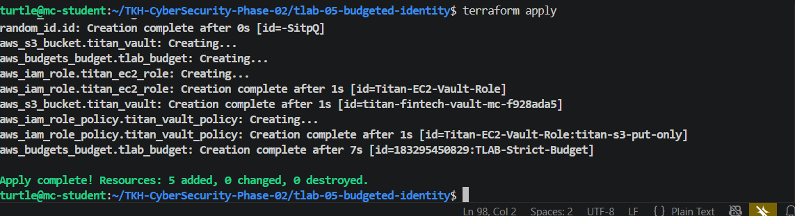
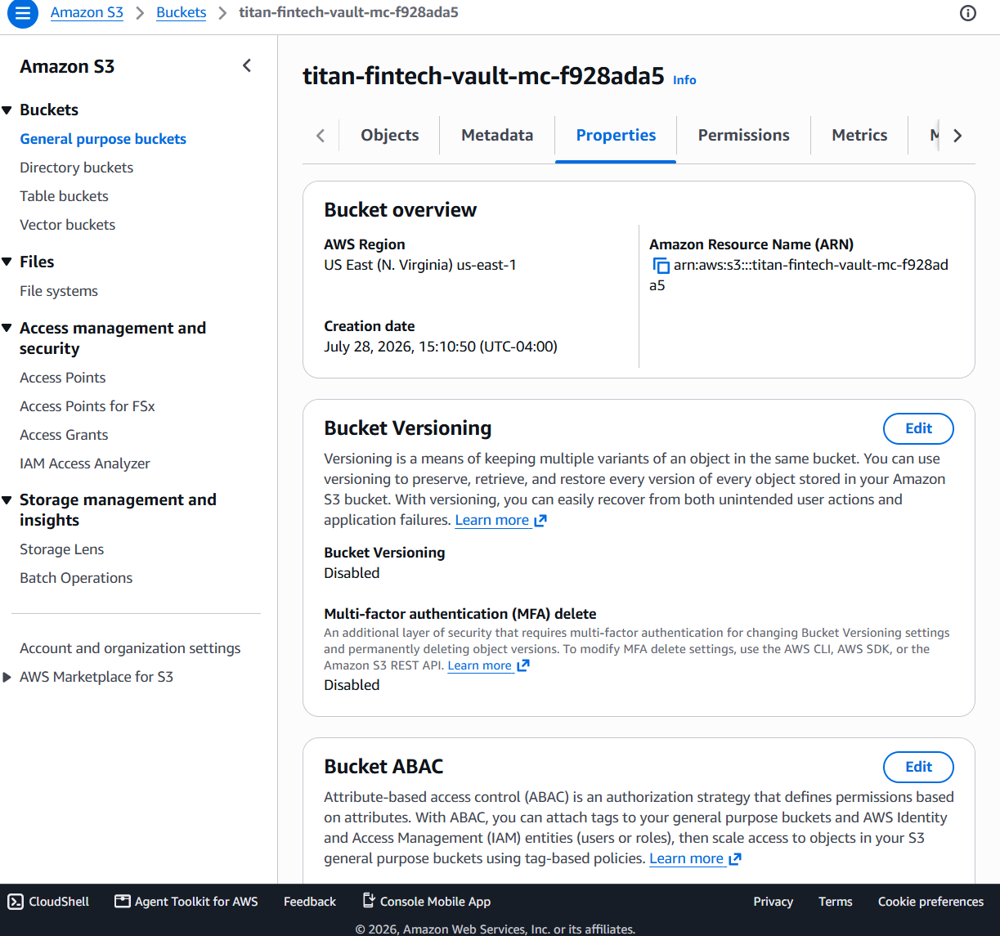
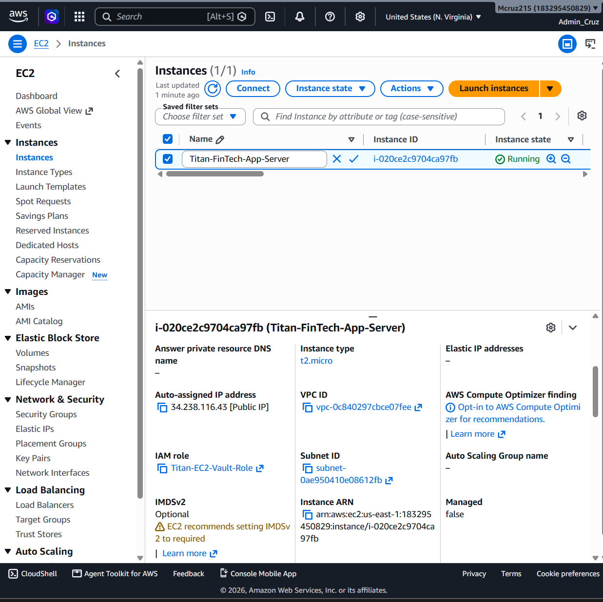
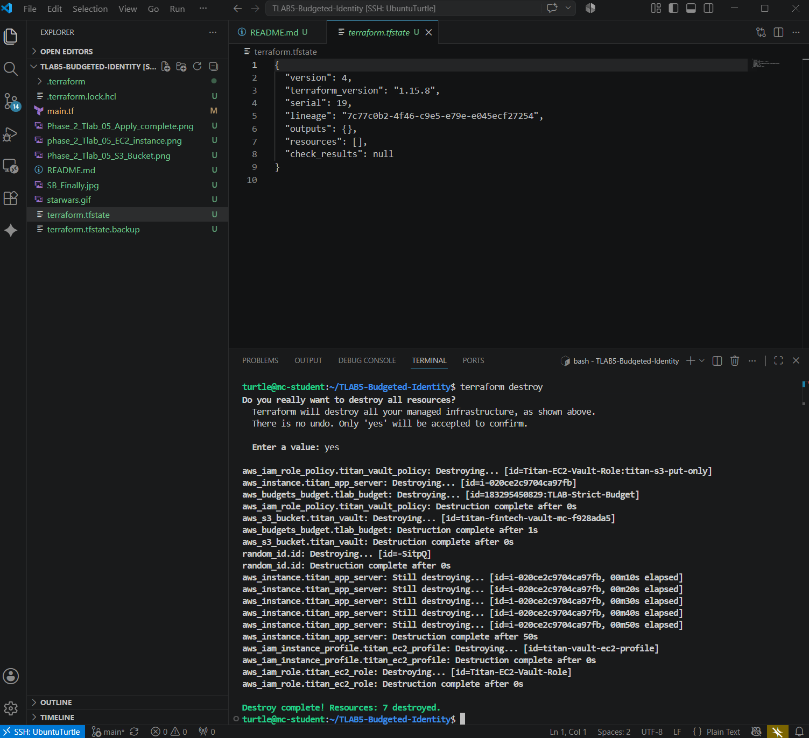

#Main.tf file breakdown
Below is the main.tf File I cloned for this assignment. The purpose of these breakdown notes is to go over the lab assignment's sabotaged code, block by block. We'll go over exactly what's in this main.tf file, why it's dangerous, and how we are going to rebuild it to satisfy the lab requirements. Some of the explanations here might seem redundant compared to the scope of the current lab and previous labs. Which is fine.......This is how you learn. 
``` hcl
provider "aws" {  
  region = "us-east-1"
}

# The Guardrail
resource "aws_budgets_budget" "tlab_budget" {  
  name              = "TLAB-Strict-Budget"  
  budget_type       = "COST"  
  limit_amount      = "50"  
  limit_unit        = "USD"  
  time_unit         = "MONTHLY"  

  notification {    
    comparison_operator        = "GREATER_THAN"    
    notification_type          = "ACTUAL"    
    threshold                  = 100    
    threshold_type             = "PERCENTAGE"    
    subscriber_email_addresses = ["admin@example.com"]  
  }
}

# The Target Identity
resource "aws_iam_user" "tlab_user" {  
  name = "tlab-service-account"
}

# SABOTAGE 1: Dangerously broad permissions attached directly to a user
resource "aws_iam_user_policy" "tlab_user_policy" {  
  name = "tlab-unrestricted-access"  
  user = aws_iam_user.tlab_user.name  

  policy = jsonencode({    
    Version = "2012-10-17"    
    Statement = [      
      {        
        Action = [          
          "ec2:",           
          "s3:*"        
        ]        
        Effect = "Allow"        
        # BUG: Broad resource access violates least privilege
        Resource = "*"      
      }    
    ]  
  })
}
The wildcard is written as ec2:* and s3:*  Resource = *
The asterisk should be in double quotes, but I haven't fully learned obsidian and so my asterisk keeps disappearing when in between quotes. 

***EDIT: I believe you keep the asterisk from activating a function through the use of backticks  "``"
### The Provider

provider "aws" {  
  region = "us-east-1"
}

This tells Terraform to deploy all of your infrastructure into Northern Virginia "us-east-1" data center.

### The Guardrail

The current state of this code sets a budget limit of $50 dollars and only alerts you when you hit 100% of that limit. It then sends an alert to a fake admin@example.com email. The CEO has a fear of "Denial of Wallet" attacks. Serverless computing offers a structure for event driven, pay-as-you-go development. This framework has also given threat actors a new form of cyber attack. A "Denial of Wallet" or "DOW", exploits the convenience of pay-as-you-go cloud and AI pricing. Similar to DDOS attacks, a threat actor would commence a blitz of requests to a service. In turn this would use up all the available resources thus rendering the service useless. This would incur a large of amount of functions to be invoked, quietly racking up a large bill for the application owner, expending their finances. 

### The Fix
To satisfy the CEO's strict cost controls, we need to fix these parameters. We will modify this block to a strict $10.00 dollar limit, and trigger the alert notification at an 80% threshold. Then, Of course, we are going to insert our own email address to receive an alert.  


### The Target & Sabotage (IAM User and Policy)

The Target Identity. What is a resource and designation? 
	In Terraform, everything built is declared as a *resource*. The first line is a naming convention composed of three parts: 
		**Resource**: This is the Block Type, There are many types of block types.  It tells Terraform you want to create a new physical piece of infrastructure in the cloud.
		**"aws_iam_user"**: This is the resource type. This is the specific AWS service we are calling. It tells the AWS provider to create an IAM user. It tells Terraform exactly *what* to build. In this case, it's an Identity and Access Management or IAM user, and *where* to build it (AWS)
		**"tlab_user"**: This is the local designation or identifier. AWS never sees this name. This is Terraform's internal nickname for this block. It only exists inside your Terraform files. If you need to attach a policy to this user later in your code, you reference this local designation, not the actual AWS name.
		**name = "tlab-service-account":** This is the actual physical name that will show up inside the AWS Console. So, the public facing name of the resource. 
Why is this a security risk in our scenario?
	An IAM User is designed for humans or long-term programmatic access via permanent Access Keys. If a service account's keys are hardcoded and leaked, an attacker has permanent access until the keys are manually revoked. For an EC2 instance, we should never use a User. We should use a **Role**, which issues temporary, auto-rotating credentials.

resource "aws_iam_user" "tlab_user" {  
  name = "tlab-service-account"
}

### The Sabotage: Wildcard Policy & Least Privilege


The first security flaw in this code revolves around the misuse of the wildcard. **What is a wildcard?** 
	In computing, a wildcard `*` acts as a placeholder or flag  that means "all" "any" or "everything". 
This policy is an example of what not to do because it weaponizes wildcards in two distinct places, completely destroying the principle of least privilege. It sabotages the "Action" and "Resource". Instead of granting the user the ability to perform one specific task (like reading a file from a bucket), The `*` grants the user permission to execute _every single command_ that exists for both the EC2 and S3 services. This means the user can spin up massive, expensive servers, delete critical databases, or expose private buckets to the public internet. By setting the resource to `*`, the policy states that the user can perform those unlimited actions on _every single server and bucket in the entire AWS account_. If compromised, this specific `tlab-service-account` user would have the exact permissions necessary to execute the "Denial of Wallet" attack the CEO fears, spinning up thousands of dollars of rogue infrastructure in minutes.

In it's current state, the starter code is actively failing the CISO's security requirements. The code creates an IAM User (tlab_user) and attaches an inline policy that grants unrestricted wildcard access (`"ec2:*"`, `"s3:*"`, and `Resource = "*"`) to everything in our AWS account. The code is also missing the actual storage vault and compute instance.
We are going to completely delete the `aws_iam_user` and `aws_iam_user_policy` blocks. In their place, we will build an **IAM Role** (`Titan-EC2-Vault-Role`). Unlike Users (which have permanent credentials), Roles use temporary credentials. We will attach a strict, policy to this Role that _only_ allows the `s3:PutObject` action, and we will scope it specifically to the ARN of the new S3 bucket we are about to build. - We will also add an `aws_s3_bucket` block dynamically named with my initials to act as the secure vault. Add an `aws_instance` block for a free-tier Ubuntu EC2 instance. Then, we will bind the new IAM Role to the EC2 instance using an `aws_iam_instance_profile`.

**What is an IAM Role?**
	An IAM Role is an AWS identity with specific permission policies attached, similar to an IAM User. However, the difference lies in how it authenticates. There are no long term credentials. ROles do not have static passwords or permanent access keys. The sessions are temporary. When an entity "assumes" a role, AWS dynamically issues temporary, short-lived security credentials via the Security Token Service (STS). These credentials expire automatically within a certain timeframe. The roles are meant to be a form of delegation. They are designed under the assumption they are being used by trusted entities such as: AWS services, applications, or identities from an external directory eg: 
	
Using an IAM User to grant EC2 instance permissions is a pretty critical security vulnerability, repeat that 5 times fast. If you attempt to use an IAM User for an application running on a server, you are forced to generate permanent Access Keys (an Access Key ID and a Secret Access Key) and manually store them directly on that server's hard drive—often in a configuration file like `~/.aws/credentials` or as plain-text environment variables. If an attacker compromises that EC2 instance, they're going to look for hardcoded keys. Once extracted, the attacker can install them on their local machine and fully compromise your AWS account from the outside, bypassing the server entirely.

When you attach an IAM Role to an EC2 instance instead (using an Instance Profile), AWS securely manages the credentials. The server's metadata service automatically provides and rotates temporary keys in the background. The application uses them seamlessly, and there is never a static, permanent secret sitting on the hard drive for an attacker to steal. The principle of utilizing temporary credentials via Roles extends beyond just EC2 instances. When talking about Serverless and containerized compute. Things like AWS Lambda functions, ECS containers, and EKS clusters must always use roles. These services must use Execution roles or Task roles to securely interact with other AWS resources, like writing logs to CloudWatch or fetching data from an S3 bucket. 

**Cross-Account Access** is a critical scenario. If a third-party vendor or an application in a different AWS account needs access to your resources, you create an IAM Role with a Trust Policy allowing their account to assume it. You should never create an IAM User for an external entity. That's......asking to be compromised. It's like being a hotel owner and giving the food supply vendors the keys to the employee only sanctioned sections, when they just needed access to the lobby and maybe kitchen. Maybe the delivery guys are bad apples and start trashing the place and stealing the employees items. 

This brings us into **Federated Human Access vs (Single sign-on : SSO)** "Single sign-on (SSO) is an authentication method allowing users to access multiple independent software systems using a single set of login credentials. It relies on a centralized identity provider (IdP) to verify identity and issue secure tokens to service providers." (Cloudflare). "Federated access, on the other hand, allows employees to use their credentials to access systems across various third-party services, but doesn’t influence a strict workflow for resource authentication."(beyondtrust.com). In modern enterprise environments, human employees should not get individual IAM Users. Instead, they should authenticate through a centralized identity provider (like Okta, Google Workspace, or Microsoft Entra ID) and assume a specific IAM Role for a temporary session based on their job requirements

There's a lil GRC. My RAG buddy suggested after mapping concepts to NIST 
### The Policy Structure: Anatomy of an IAM JSON

AWS evaluates permissions using highly structured JSON documents. The `jsonencode` function in Terraform takes standard text and formats it into this strict JSON structure that AWS requires.

Here is how the core components of the policy document dictate security rules:

| **JSON Element** | **Definition**                                                                          | **Application in this Code**                                |     |
| ---------------- | --------------------------------------------------------------------------------------- | ----------------------------------------------------------- | --- |
| **Version**      | The syntax version of the policy language.                                              | `"2012-10-17"` is the current, standard AWS policy version. |     |
| **Statement**    | The main container for a single permission rule. Policies can have multiple statements. | We have one array `[` containing one set of rules `{}`.     |     |
| **Effect**       | Determines whether the rule permits or blocks access.                                   | `"Allow"` means the specified actions are granted.          |     |
| **Action**       | The specific API commands the identity is allowed (or denied) to run.                   | `"ec2:*"` and `"s3:*"`                                      |     |
| **Resource**     | The exact AWS assets (buckets, servers, databases) the actions can be performed on.     | `"*"`                                                       |     |
### The Fix

#### The Global Uniqueness Generator ( Random ID)

##### Generate a random string to ensure the S3 bucket name is globally unique

resource "random_id" "id" {
  byte_length = 4
}
AWS S3 bucket names must be _globally unique_ across every single AWS account in the world. If another student already created "titan-fintech-vault-mc", my `terraform apply` would fail. This block generates a random 4-byte hexadecimal string (like `a1b2c3d4`) that we will attach to the end of our bucket name to guarantee our code deploys successfully on the first try.

#### The Secure Storage Vault (Step 3)

##### Step 3: The Secure S3 Vault
resource "aws_s3_bucket" "titan_vault" {
  bucket = "titan-fintech-vault-mc-${random_id.id.hex}"
}
Step 3 requires an `aws_s3_bucket` named dynamically with our initials.
The `${...}` syntax is called **Terraform Interpolation**. It lets us inject variables directly into a string. We are combining the hardcoded string `"titan-fintech-vault-mc-"` with the dynamic hex value generated by the `random_id` block above it. The lab states the bucket must be private. As of April 2023, AWS changed the default behavior of S3—all new buckets automatically block public access. The bucket resource is now private by default. Therefore, simply creating the bucket resource inherently satisfies this security requirement without needing extra lines of code.

### The Trust Policy (Step 4 - Part 1)

##### Step 4: The IAM Role (The "Identity" for our EC2 server)
resource "aws_iam_role" "titan_ec2_role" {
  name = "Titan-EC2-Vault-Role"

  assume_role_policy = jsonencode({
    Version = "2012-10-17"
    Statement = [
      {
        Action = "sts:AssumeRole"
        Effect = "Allow"
        Principal = {
          Service = "ec2.amazonaws.com"
        }
      }
    ]
  })
}

Step 4 requires an IAM Role named `Titan-EC2-Vault-Role` with a Trust Policy for EC2.
**The Trust Policy (`assume_role_policy`):** Roles require a very specific type of policy that dictates _who_ or _what_ is allowed to wear them. By setting the `Principal` to `ec2.amazonaws.com` and the `Action` to `sts:AssumeRole`, we are telling AWS: "Only an EC2 instance is allowed to assume this identity and request temporary credentials."

### The Permissions Policy (Step 4 - Part 2)
###### Step 4: The Surgical Permissions Policy
resource "aws_iam_role_policy" "titan_vault_policy" {
  name = "titan-s3-put-only"
  role = aws_iam_role.titan_ec2_role.id

  policy = jsonencode({
    Version = "2012-10-17"
    Statement = [
      {
        Action = "s3:PutObject"
        Effect = "Allow"
        Resource = "${aws_s3_bucket.titan_vault.arn}/*"
      }
    ]
  })
}

The CISO demanded we adhere to the Principle of Least Privilege and never hardcode the ARN (Amazon Resource Name). Instead of `s3:*`, the `Action` is restricted to exactly one API call: `s3:PutObject`. The server can write files to the vault, but it cannot read them, delete them, or alter the bucket settings. Also Instead of using `Resource = "*"`, we use Terraform interpolation again: `${aws_s3_bucket.titan_vault.arn}/*`. This tells Terraform to dynamically fetch the exact Amazon Resource Name of the bucket we just built, and the `/*` at the end specifies that the permissions apply to the objects _inside_ the bucket, rather than the bucket itself.

I like understanding why things work the way they do, I usually do this with everything unless I hit a "hard math" wall if that's applicable. Will I remember everything I write here??? Sure.....overtime and practice. This field reminds me of something my intro to finance professor told my class one time. "Finance isn't something that you just do once and learn. you have to do it constantly to remember it."

**What is sts:AssumeRole and the principle**
An EC2 instance doesn't just possess the permissions of a Role; it has to actively request them. STS stands for **Security Token Service**. This is the specific AWS API command used to request temporary security credentials. The **Principal** defines exactly _who_ or _what_ is legally allowed to make that `sts:AssumeRole` request. By defining `Service = "ec2.amazonaws.com"` as the Principal in our Trust Policy, we are building a strict bouncer at the door. If a Lambda function, a human IAM User, or a server from a different cloud provider tries to call `sts:AssumeRole` for this specific role, the AWS bouncer checks the Principal, sees they are not an EC2 service, and instantly denies them.

**What is an ARN?**

An **ARN** is the absolute, globally unique identifier for every single resource inside the entire AWS ecosystem. Think of it like a highly specific URL or an absolute file path on a hard drive. If AWS is a giant global filing cabinet, the ARN dictates the exact region, account, drawer, and folder where a resource lives. It's format usually looks like: **arn:aws:s3:::titan-fintech-vault-mc-a1b2c3d4**. In our policy, we used Terraform interpolation (`${aws_s3_bucket.titan_vault.arn}`) instead of typing the ARN manually. Because the S3 bucket has a randomly generated hex at the end of its name, we literally _cannot_ know the exact ARN until the exact millisecond AWS creates it. Interpolation allows Terraform to build the bucket, grab the newly minted ARN, and seamlessly inject it into the IAM policy. 

To complete the architecture for "Titan FinTech," we must deploy the actual compute server (the EC2 instance) and attach our securely scoped IAM Role to it. In AWS, you cannot attach an IAM Role directly to an EC2 instance; you must use an intermediary container called an **Instance Profile**. We discussed this somewhere up above

# Step 5 - Part 1: The Instance Profile (The Bridge)
resource "aws_iam_instance_profile" "titan_ec2_profile" {
  name = "titan-vault-ec2-profile"
  role = aws_iam_role.titan_ec2_role.name
}

An Instance Profile is essentially a logic container for an IAM Role. While a human user or a Lambda function can assume a role directly, an EC2 instance requires this special wrapper to securely request and pass the temporary credentials from the AWS Security Token Service (STS) into the server's internal metadata. The `role = aws_iam_role.titan_ec2_role.name` argument creates a hard dependency. Terraform will read this and understand that it must fully construct the IAM Role from Step 4 before it can create this Instance Profile.

# Step 5 - Part 2: Dynamic AMI Data Source (The Operating System Blueprint)
data "aws_ami" "ubuntu" {
  most_recent = true
  owners      = ["099720109477"] # Canonical's official AWS account ID (creators of Ubuntu)

  filter {
    name   = "name"
    values = ["ubuntu/images/hvm-ssd/ubuntu-jammy-22.04-amd64-server-*"]
  }
}

#### data "aws_ami"
Earlier I mentioned there are different types of blocks. So far we've only used resource blocks. Resource blocks command Terraform to create new physical infrastructure. a **data**
block is entirely different. It instructs Terradorm to perform a read-only query against the AWS API to get existing information. 

Hardcoding an Amazon Machine Image (AMI) ID is a poor practice because AWS frequently deprecates old images and releases patched versions. If an AMI ID gets deprecated, a hardcoded Terraform script will completely break. The filters and owners tags keep our operating system current. We are telling Terraform to scan Canonical's official account (`099720109477`) and pull the absolute latest, most recent blueprint for Ubuntu 22.04. This guarantees our code remains highly available and resilient against future image updates.
# Step 5 - Part 3: The Compute Resource (The EC2 Server)
resource "aws_instance" "titan_app_server" {
  ami                  = data.aws_ami.ubuntu.id
  instance_type        = "t2.micro"
  iam_instance_profile = aws_iam_instance_profile.titan_ec2_profile.name

  tags = {
    Name = "Titan-FinTech-App-Server"
  }
}
###  Finally The Compute Resource

My brain has turned to mush by this point, so let's keep it short and sweet. *PS: it's never short and sweet, I'm a walking Irish goodbye. (I'm also neither short....or Irish....)*   The amazon machine image is the blueprint. Actually let me go a point back. Let's go over Interpolation one more time and why that matters for the AMI. Then we'll go over the cost control keeping this Free99, and how the instance profile gets attached securely. 

In Terraform, interpolation (direct referencing) is how you tell Terraform to not read something in plain text; go fetch a value from somewhere else and inject it "here". In modern Terraform, if the _entire line_ is just a reference, you don't even need the `${}` or quotes. You just point directly to the resource path, like `data.aws_ami.ubuntu.id`. Historically, and whenever you are mixing variables inside a sentence or string, you use the `${...}` syntax We did this earlier with the S3 bucket name: "titan-fintech-vault-mc-${random_id.id.hex}" Interpolation makes Terraform IaC instead of just a static text file. 

### Breaking down the AMI
Back to the blueprint I was talking about before **ami = data.aws_ami.ubuntu.id**. We're going to break down this line The aws_instance block is where the physical server is actually provisioned in the AWS data center.

What is an AMI? AMI stands for **Amazon Machine Image**. It is a complete, pre-configured snapshot of a hard drive containing a OS  (like Ubuntu or Windows) and any necessary boot software. You cannot launch an EC2 instance without telling AWS which AMI to install on its root drive. Every AMI has a unique identifier. Instead of typing that random string manually, we use our good ole' magic wand **interpolation**, to connect that block to our data block. 

**`ami =`** : This is the required argument inside the `aws_instance` resource. AWS demands to know exactly which Amazon Machine Image to use for the root hard drive. It expects a string formatted like `ami-0c55b159cbfafe1f0`.

**`data.`** : This instructs Terraform to look at your read-only queries, rather than the physical resources you are building

**`ubuntu.`** : This is the **local designation** (the nickname) we gave our specific query. If we had multiple data blocks searching for different things (like one for Windows and one for Ubuntu), this tells Terraform exactly which one to reference

**`.id`** : This is the specific **attribute** we are extracting. When the data block successfully queries AWS and finds the latest Ubuntu image, it returns a massive list of information. The `.id` isolates just the exact AMI ID string and injects it into our `ami =` argument.

By writing the code this way, instead of using a hardcoded string or the old `${}` syntax we are future proofing. If we run this code today, it might pull `ami-1111`. If we run this code six months from now, Canonical will have released a newer, more secure version. Because we used interpolation to point to the `data` block, Terraform will automatically grab the new `ami-2222` without us ever having to rewrite our code. Terraform is smart enough to read this interpolation and understand the order of operations it will see data.aws_ami.ubuntu.id inside the aws_instance block and halt building the server until it runs the Ubuntu data query first, get the results, then finish building the server. 

Now to the instance type. If the AMI is the software/hard drive the **instance_type** dictates the physical motherboard, CPU, and RAM. AWS offers hundreds of instance types. This itself is a guardrail. **instance_type = "t2.micro"** forces the deployment exactly 1 virtual CPU and 1 GiB of RAM. By hardcoding this specific instance type, we establish a physical, architectural guardrail. Even if an attacker somehow breached the server, they are stuck with a tiny, low-powered machine that cannot run........much. This aligns with the paranoid CEO's fear of a "Denial of Wallet" attack by capping the physical compute capacity. `t2.micro` is strictly covered under the AWS Free Tier, hooray for our budget. 

The **iam_instance_profile**. This is the security badge. This is how the EC2 instance wears that IAM Role we built. It works via the **IMDS or Instance Metadata Service**. When the server boots up with this instance profile attached, AWS automatically places a set of temporary, auto-rotating access keys inside the server's internal brain eg: **The IMDS**. If you write a Python script on this server to upload a file to S3, you don't need to write any passwords into your script. The AWS SDK
is smart enough to quietly ask the IMDS for those temporary keys, sign the request, and send it to S3. The server acts with the strict, limited permissions of the Role, completely eliminating the need for hardcoded credentials. Thanks interpolation!!!!

## Finally

 

**terraform fmt** 
This automatically aligns all our equal signs and brackets 

**terraform init**
downloads the AWS provider so Terraform knows how to talk to the cloud.

**terraform validate**
This runs a quick check to make sure there are no typos or broken interpolations. It should return "Success! The configuration is valid."

**terraform apply**
Terraform will output a massive plan showing exactly what it is about to build (a budget, an S3 bucket, an IAM Role, an Instance Profile, and an EC2 instance). Type `yes`

and last but not least 

terraform destroy 

**Mission Accomplished:**


### Deployment Artifacts

**Terminal Output:**


**S3 Secure Vault:**


**EC2 Compute Identity:**


**Destroy Complete:**


# Sike


## Obstacles & Troubleshooting

No cloud engineering project is complete without real-world troubleshooting. During the teardown phase of this lab, I encountered a classic Infrastructure as Code (IaC) hurdle: Terraform seemingly forgot about the infrastructure it had just built.

When attempting to run the initial teardown, Terraform threw an inconsistent dependency lock file error because the random provider block was introduced to the configuration after the initial initialization. So I upgraded the provider plugins: terraform init -upgrade

The real problem came when I tried to run the terraform destroy. It's probably my fault somewhere along the line. In the pursuit of an aesthetic README, and adding image and gif files to my V-folders in my VS Code. Something happened, a new terminal opened up everything was great! Then I ran Terraform destroy and got "Destroy complete! Resources: 0 destroyed." Despite having seven resources actively running in my AWS account, Terraform's local memory—the terraform.tfstate file—was blank. I realized that my original terraform apply command had been executed from a different directory. So, my current working directory only an empty .tfstate file. That file had to be somewhere, I can't destroy what's suppose to be there, but it's not there and I haven't been the one to destroy it. Rather than giving up and resorting to manually deleting the resources via the AWS Management Console, I used the Linux command-line utilities to look for the missing state file. I executed a search from my home directory to locate all state files and analyze their byte sizes to find the fully populated one

**find ~ -name "terraform.tfstate" -ls** 

The detective work paid off. I successfully located the true, 18KB state file hiding in my previous TKH-CyberSecurity-Phase-02 directory. To restore Terraform's memory, I copied the populated state file into my active working directory, overwriting the blank one

**cp /home/turtle/TKH-CyberSecurity-Phase-02/tlab-05-budgeted-identity/terraform.tfstate . **
With the state file restored, the final execution of terraform destroy accurately identified and dismantled all 7 AWS resources, successfully protecting the environment and the budget.

**Boom Destroy**


## References 

https://www.sciencedirect.com/science/article/pii/S221421262100079X
Scholarly article on Denial of Wallet attacks and it's threat to serverless computing
https://www.cloudflare.com/learning/access-management/what-is-sso/
Explains what Single Sign on (SSO) is 
https://www.beyondtrust.com/resources/glossary/federated-access
Federated Access vs Single Sign on
https://developer.hashicorp.com/terraform/language/data-sources
HashiCorp documentation explaining the difference between creating infrastructure (`resource`) and querying existing infrastructure (`data`).
https://developer.hashicorp.com/terraform/language/expressions/references
Explains modern Terraform syntax for referencing attributes from other blocks, creating implicit dependencies without needing the  `${}` string interpolation unless combining text.
https://docs.aws.amazon.com/AWSEC2/latest/UserGuide/iam-roles-for-amazon-ec2.html
AWS documentation detailing why IAM Users are dangerous on EC2, and how Instance Profiles securely pass temporary credentials to applications running on the server
https://aws.amazon.com/blogs/security/how-to-use-trust-policies-with-iam-roles/
AWS Security Blog post breaking down the "Principal" element and how trust policies act as the "bouncer" to dictate exactly who or what can assume a role.
https://docs.aws.amazon.com/AWSEC2/latest/UserGuide/AMIs.html
Defines what an AMI is (the OS blueprint) and why selecting the right architecture and version is necessary to launch an EC2 instance.
https://docs.aws.amazon.com/AmazonS3/latest/userguide/security-best-practices.html
AWS best practices for securing S3 buckets, tying back to our IAM policy that only allows the `s3:PutObject` action.

https://developer.hashicorp.com/terraform/language/state/purpose
HashiCorp documentation explaining the purpose of Terraform state (terraform.tfstate), how it acts as a database mapping real-world resources to your configuration, and why losing it causes Terraform to "forget" existing infrastructure.
https://developer.hashicorp.com/terraform/language/files/dependency-lock
HashiCorp documentation on the Dependency Lock File (.terraform.lock.hcl), explaining how Terraform tracks provider plugin versions and why the terraform init -upgrade command is necessary when adding new providers like random.
https://registry.terraform.io/providers/hashicorp/random/latest/docs/resources/id
Official HashiCorp documentation for the random_id resource, used to generate cryptographically strong random identifiers to prevent global namespace collisions when creating S3 buckets.
https://docs.aws.amazon.com/cost-management/latest/userguide/budgets-managing-costs.html
AWS documentation on using AWS Budgets to set custom cost limits and track usage, serving as the primary financial guardrail against the Denial of Wallet attacks mentioned in the introductory concepts.